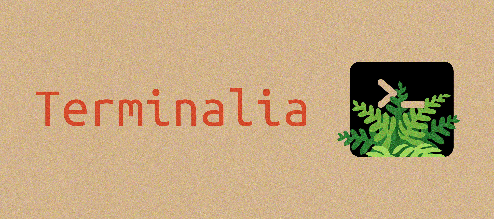
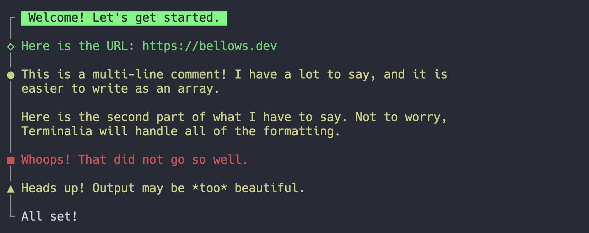
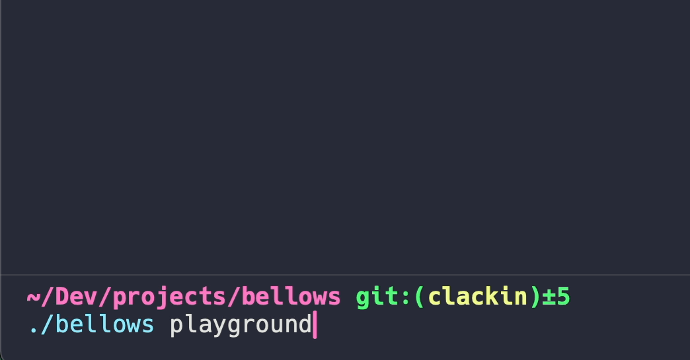
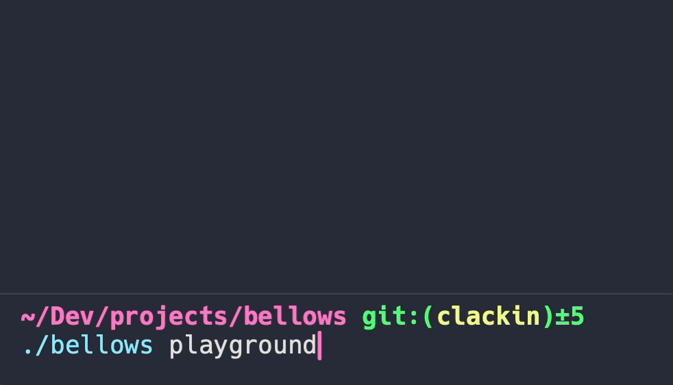

> [!IMPORTANT]
> Hey! This was a fun project and I learned a lot. It's not the most stable though. I would recommend using [Laravel Prompts](https://github.com/laravel/prompts). It gets the job done (better) and is well tested and stable.

The UX of [Clack](https://github.com/natemoo-re/clack), the DX of [Laravel](https://laravel.com) for your Artisan commands.

-   [Features](#features)
-   [Demo](#demo)
-   [Installation](#installation)
-   [Retrieving Input](#retrieving-input)
-   [Writing Output](#writing-output)

## Features

-   Inline input validation using Laravel's built-in validator
-   Interactive prompts for text, choice, and confirmation
-   A spinner for long-running processes

## Demo


## Installation

```bash
composer require joetannenbaum/terminalia
```

This package implements a Console mixin, which should be automatically registered when the package is installed.

If the service provider doesn't automatically register (i.e. if you are using [Laravel Zero](https://laravel-zero.com)), add the following to your `config/app.php` file:

```php
'providers' => [
    // ...
    Terminalia\Providers\TerminaliaServiceProvider::class,
],
```

## Retrieving Input

### Input Validation

The `rules` argument of these methods uses [Laravel's built-in validator](https://laravel.com/docs/validation#available-validation-rules), so it accepts anything you are able to pass to `Validator::make`.

**Note:** If you're using validation within a [Laravel Zero](https://laravel-zero.com) app, remember to register your `ValidationServiceProvider::class` and `TranslationServiceProvider::class` in your `config/app.php` file and also include a `lang` directory in your project root.

### `termAsk`

The `termAsk` method prompts the user for input and return the response. It accepts the following arguments:

-   `question` (string): The question to ask the user
-   `rules` (string|array): An array of validation rules to apply to the response
-   `hidden` (bool): Whether or not to hide the user's input (useful for passwords)
-   `default` (string): The default value

```php
$answer = $this->termAsk(
    question: 'What is your favorite color?',
    rules: ['required'],
);

$password = $this->termAsk(
    question: 'What is your password?',
    rules: ['required'],
    hidden: true,
);
```

### `termChoice`

The `termChoice` method prompts the user to select one or more items from a list of choices. It accepts the following arguments:

-   `question` (string): The question to ask the user
-   `choices` (array|`Collection`|`Helpers\Choices`): An array of choices to display to the user
-   `multiple` (bool): Whether or not to allow the user to select multiple choices
-   `rules` (string|array): An array of validation rules to apply to the response
-   `filterable` (bool): Whether or not to allow the user to filter the choices
-   `minFilterLength` (int, default is `5`): The minimum number of choices in the list before filtering is enabled
-   `default` (string|array): The default value(s)

If `multiple` is `true` and you pass a `Collection` as the `choices` argument, the `choices` will be returned as a `Collection` as well, otherwise an array will be returned.

```php
$answer = $this->termChoice(
    question: 'What is your favorite color?',
    choices: ['red', 'green', 'blue'],
    rules: ['required'],
);

$favoriteThings = $this->termChoice(
    question: 'Which are your favorite things:',
    choices: [
        'raindrops on roses',
        'whiskers on kittens',
        'bright copper kettles',
        'warm woolen mittens',
        'brown paper packages tied up with strings',
        'cream colored ponies',
        'crisp apple strudels',
        'doorbells',
        'sleigh bells',
        'schnitzel with noodles',
    ],
    multiple: true,
    rules: ['required'],
    filterable: true,
);
```

Instead of just passing a simple array as the `choices` argument, you can choose to pass in a nested array or collection using the `Choices` helper. This allows you to specify a label and a value for each item in the list. The label will be displayed to the user, and the value(s) will be returned when the user selects the item.

```php
use Terminalia\Helpers\Choices;

$users = User::all();

// Choices will display the user's name and return a User model
$user = $this->termChoice(
    question: 'Which user would you like to edit?',
    choices: Choices::from($users, 'name'),
);

// Choices will display the user's name and return the user ID
$user = $this->termChoice(
    question: 'Which user would you like to edit?',
    choices: Choices::from($users, 'name', 'id'),
);

// Choices will be displayed with the user's full name, will return a User model
$user = $this->termChoice(
    question: 'Which user would you like to edit?',
    choices: Choices::from($users, fn($user) => "{$user->firstName} {$user->lastName}"),
);

// Choices will be displayed with the user's full name, will return the user ID
$user = $this->termChoice(
    question: 'Which user would you like to edit?',
    choices: Choices::from(
        $users,
        fn($user) => "{$user->firstName} {$user->lastName}",
        fn($user) => $user->id,
    ),
);

// Defaults will be determined by the display value when no return value is specified
$user = $this->termChoice(
    question: 'Which user would you like to edit?',
    choices: Choices::from($users, 'name'),
    default: 'Joe',
);

// Defaults will be determined by the return value if it is specified
$user = $this->termChoice(
    question: 'Which user would you like to edit?',
    choices: Choices::from($users, 'name', 'id'),
    default: 123,
);
```

### `termConfirm`

The `termConfirm` method prompts the user to confirm a question. It accepts the following arguments:

-   `question` (string): The question to ask the user
-   `default` (bool): The default answer to the question

```php
$answer = $this->termConfirm(
    question: 'Are you sure you want to do this?',
);
```

## Writing Output

### `termIntro`

The `termIntro` method writes an intro message to the output. It accepts the following arguments:

-   `text` (string): The message to write to the output

```php
$this->termIntro("Welcome! Let's get started.");
```

### `termOutro`

The `termOutro` method writes an outro message to the output. It accepts the following arguments:

-   `text` (string): The message to write to the output

```php
$this->termOutro('All set!');
```

### `termInfo`, `termComment`, `termError`, `termWarning`

Consistent with Laravel's built-in output methods, Terminalia provides methods for writing output in different colors with cohesive styling. They accept the following arguments:

-   `text` (string|array): The message to write to the output

```php
$this->termInfo('Here is the URL: https://bellows.dev');

$this->termComment([
    'This is a multi-line comment! I have a lot to say, and it is easier to write as an array.',
    'Here is the second part of what I have to say. Not to worry, Terminalia will handle all of the formatting.',
]);

$this->termError('Whoops! That did not go so well.');

$this->termWarning('Heads up! Output may be *too* beautiful.');
```



### `termNote`

The `termNote` method allows you to display a longer message to the user. You can include an optional title as the second argument, if you have multiple lines you can optionally pass in an array of strings as the first argument.

```php
// Regular note
$this->termNote(
    "You really did it. We are so proud of you. Thank you for telling us all about yourself. We can't wait to get to know you better.",
    'Congratulations',
);

// Multiple lines via an array
$this->termNote(
    [
        'You really did it. We are so proud of you. Thank you for telling us all about yourself.',
        "We can't wait to get to know you better."
    ],
    'Congratulations',
);

// No title
$this->termNote(
    [
        'You really did it. We are so proud of you. Thank you for telling us all about yourself.',
        "We can't wait to get to know you better."
    ],
);
```


### `termSpinner`

The `termSpinner` method allows you to show a spinner while an indefinite process is running. It allows customization to you can inform your user of what's happening as the process runs. The result of the spinner will be whatever is returned from the `task` argument.

**Important:** It's important to note that the `task` runs in a forked process, so the task itself shouldn't create any side effects in your application. It should just process something and return a result.

**Simple:**

```php
$site = $this->termSpinner(
    title: 'Creating site...',
    task: function () {
        // Do something here that takes a little while
        $site = Site::create();
        $site->deploy();

        return $site;
    },
    message: 'Site created!',
);
```


**Displays a variable final message based on the result of the task:**

```php
$site = $this->termSpinner(
    title: 'Creating site...',
    task: function () {
        // Do something here that takes a little while
        $site = Site::create();
        $site->deploy();

        return $site->wasDeployed;
    },
    message: fn($result) => $result ? 'Site created!' : 'Error creating site.',
);
```



**Updates user of progress as it works:**

```php
$site = $this->termSpinner(
    title: 'Creating site...',
    task: function (SpinnerMessenger $messenger) {
        // Do something here that takes a little while
        $site = Site::create();

        $messenger->send('Site created, deploying');
        $site->deploy();

        $messenger->send('Verifying deployment');
        $site->verifyDeployment();

        return $site->wasDeployed;
    },
    message: fn($result) => $result ? 'Site created!' : 'Error creating site.',
);
```


**Sends users encouraging messages while they wait:**

```php
$site = $this->termSpinner(
    title: 'Creating site...',
    task: function () {
        // Do something here that takes a little while
        $site = Site::create();
        $site->deploy();
        $site->verifyDeployment();

        return $site->wasDeployed;
    },
    // seconds => message
    longProcessMessages: [
        3  => 'One moment',
        7  => 'Almost done',
        11 => 'Wrapping up',
    ],
);
```


### Progress Bars

Progress bars have a very similar API to [Laravel console progress bars](https://laravel.com/docs/artisan#progress-bars) with one small addition: You can pass in an optional title for the bar.

```php
$this->withTermProgressBar(collect(range(1, 20)), function () {
    usleep(300_000);
}, 'Progress is being made...');
```


```php
$items = range(1, 10);
$progress = $this->createTermProgressBar(count($items), 'Updating users...');

$progress->start();

foreach ($items as $item) {
    $progress->advance();
    usleep(300_000);
}

$progress->finish();
```



```php
$this->withTermProgressBar(collect(range(1, 20)), function () {
    usleep(300_000);
});
```


